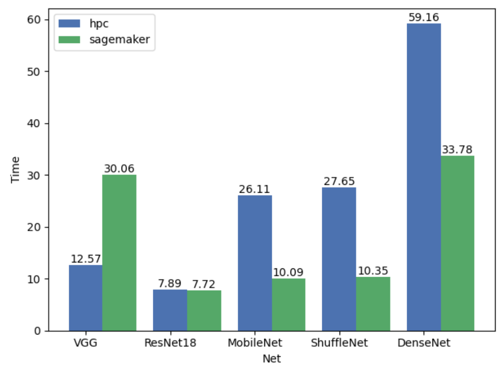
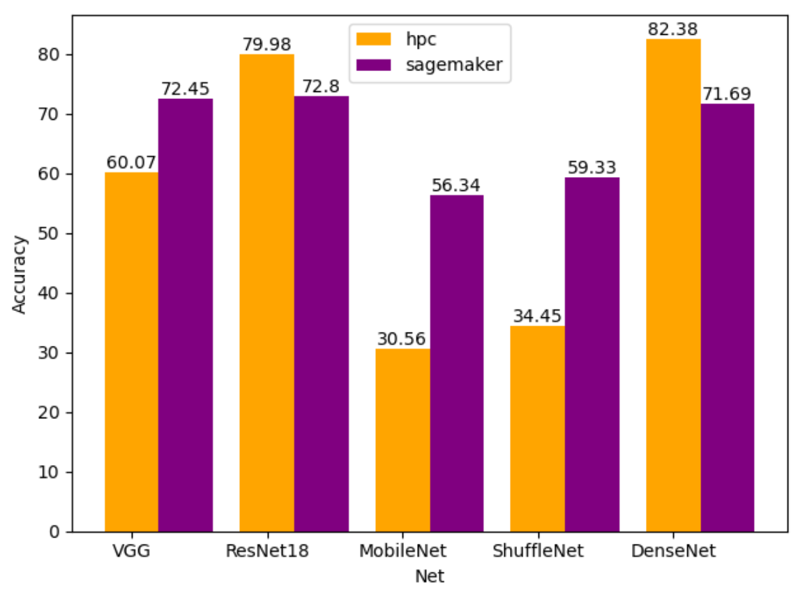

## Distributed Training based on Amazon Sagemaker
This is a comparison of experiment based on Amazon Sagemaker distributed library and normal 
data parallel training.

Our experiments based on 5 DNNs: VGG, ResNet18, MobileNet, ShuffleNet, DenseNet.

### Run on Sagemaker
Parameter settings in `sagemaker_submission.py`, you need to:

1. Enter you AWS Access ID and Key. 
2. Adjust the S3 data path according to your own settings(in AWS)
3. You can use Sagemaker Notebook or local to run experiments

### Paramter Pre-defined
| Dataset | Epoch | Optimizer | Learning Rate | Number of Worker | Batch size |
| ------  | ----  | --------  | ------------- | ---------------- | ---------- |
| CIFAR-10|  20   | Adadelta  |     0.1       |       2          |     128    |

### Results
Speedup Comparison:

Accuracy Comparison:

